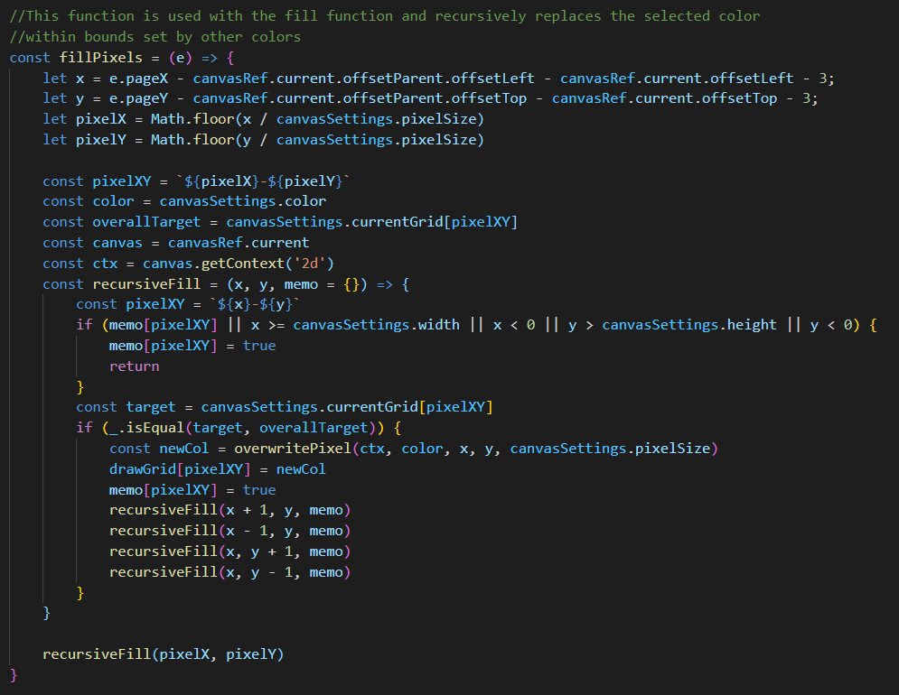
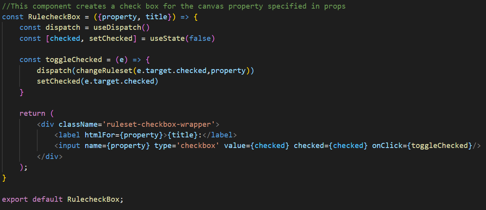

# Pixel Showdown #
[Documentation](./documentation)

[Live Site](https://pixel-showdown.herokuapp.com)

## About ##
Pixel Showdown is an original, full stack web application that allows users to create pixel art and compete in pixel art competitions. The central feature to the site is the dynamic pixel art editor which includes tools common to most drawing software coupled with animation capabilities. Other key features incldue the ability for users to create, judge, and compete in competitions with customized rulesets. Customizable rules includes the allowed image editor tools, time limit, and color palette available. Along with all of this, users are able to follow one another, sketch freely, and set their profile pictures to an image of their own creation. Overall, Pixel Showdown is a place to express your creativity and competitiveness through pixel art.

## Installation ##
1. Clone the GitHub repository.
2. Create a database user with your desired password using PostgreSQL.
3. Create a new database with the user from the previous step as the owner.
4. Create an AWS IAM user and public Bucket with permissions granted to the IAM user.
5. Create a .env file using the guidelines of the example.env file, adding in the information from the previous three steps.
6. Run ***npm install*** in the react-app directory.
7. In the main directory run ***pipenv install --dev -r dev-requirements.txt && pipenv install -r requirements.txt***.
8. Open your pipenv shell by running ***pipenv shell***.
9. Run ***flask db upgrade***.
10. Run ***flask seed all***.
11. Run ***flask run*** to start the backend server.
12. To start the react server, exit your pipenv shell and run ***npm start*** in the react-app directory.

## Technologies Used ##
Pixel Showdown utilizes several key technologies in order to operate in an efficient manner. The front end uses React and Redux while the back end uses a combination of Flask, SQLAlchemy, and PostgreSQL. In addition to this, AWS is used for cloud storage of user art.

## Key Features ##

### Image Editor ###
The image editor is integral to the funcionality of the site. When the user makes a stroke on the canvas the coordinates on from the mouse position are grabbed and the selected pixel(s) are altered based on the current tool. Information on the current drawing is stored in Redux until the save button is clicked. This results in the information being converted to base64 and sent to the backend server where it is processed into GIF and APNG format and subsequently uploaded to AWS. Key features of the image editor include the ability to select a color/opacity, draw, erase, copy a color, fill a selected area, swap a color, and undo/redo an action. Additionally, the editor has animation capabilities with customizable frame counts and frame rates along with the ability to copy and paste frames.

***A low skill demonstration of the image editor.***

***A code snippet that handles the recursive logic of the fill tool***

### Ruleset Generation ###
The ability to create customized rulesets allows users to create fun challenges for their friends and followers. When creating a ruleset, a user can disable a variety of tools used by the image editor, set a time limit, create a custom color palette, and more. As they fill out the form, users are able to see a live preview of what the image editor will look like for the competition. This is possible through live Redux changes that are fed into the image editor that act to disable/alter different tools.

***A demonstration of the ruleset generator.***

***A code snippet that handles the logic for updating the redux store with custom rules***

## Challenges ##
Plenty of interesting challenges were encountered in the development of Pixel Showdown. One of the more intriguing issues was how to store image data. At first images were stored completely within the database with pixel by pixel color and alpha values, however this ended up being quite a bit less efficient in image retrieval than using static URLs. As such, a method for converting pixel color information to APNG and GIF files was developed and AWS storage was implemented. Raw pixel color information was still stored in the database, but was now only fetched when a user decided to edit an existing image. This greatly increased efficiency by reducing the magnitude of data that needed to be retrieved.

One challenge that was fun to address was optimizing the HTML canvas element for use in pixel art. This required various unique solutions such as using a custom hook to better integrate the element into React as well as handling what the definition of a pixel was. In order to make this element truly dynamic, a rendering method was created for it that would scale based off of the pixel width selected by the user. In this way, a pixel on the canvas would really be something like 20 pixels on the screen. This logic was central to later integration of all the other canvas tools.
