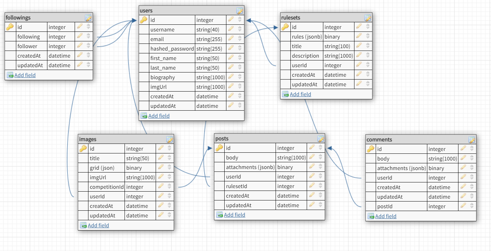

# Description for Pixel Showdown #
Pixel Showdown is a website aimed at encouraging creativity and friendly competition. Users who are logged in will be able to draw sketches, create competitions, create competition rule sets, participate in competitions and make posts. A key focus of this website is drawing pixel art. As such, it will include a customizable pixel art canvas/editor.

When creating a competition rule set, users will be able to set time limits, submission number limits, a description of the challenge, canvas size, colors available, and tools available. Users can use a competition rule set to create and post a competition of their own for other users to participate in. The creator of the competition will judge the participants and select the top three submissions once the competition time window has expired. Users who win will receive a number of points that scales with the number of competition entries. Additionally, users can make posts including rule sets they have generated and drawings they have made in a free sketch mode.

# MVP List #
1. Users are able to use the free sketch mode to draw custom pixel art using any tools available. They are able to save this sketch to their profiles or download it as a png to share elsewhere. Editing tools include:
    - Pencil/brush with customizable thickness
    - Color pallette
    - Custom color selector
    - Opacity/alpha selector
    - Eraser
    - Undo/Redo buttons (accessible with ctrl+Z and ctrl+Y)
    - Fill area tool/brush
    - Select color tool/brush
    - Replace color with current color tool/brush
2. Users can create custom rulesets for competitions. They are able to customize features such as:
    - How long participants have to draw their submissions
    - What editing tools are available
    - Canvas size (1x1 to 100x100 px)
    - A description for what to draw
    - The maximum number of submissions overall
    - The maximum number of submissions from one user
    - How long the competition will be open for (1-48 hours)
    - Color pallette availability/default colors
3. Users will be able to make threads. Threads can be either competitions or informational. Competition threads will open competitions for other users to info while informational threads could include text, links to a user's images, or links to their own ruleset(s)
4. Users will be able to follow other users and their posts will be highlighted on the homepage in a feed.
5. User profiles will allow them to see all free draw photos and competition photos. It will also allow them to change their user icon to any image in their own profile. (no outside images/uploads)

# Stretch Goals #
1. Add in animation capabilities, allowing user images to have multiple frames which can be strung together in a GIF.
2. Add in ability to like/dislike rulesets, posts, and competition submissions. Likes translate into points.
3. Add in a search feature for users/posts/rulesets.
4. Add in a notification system to alert users to posts by those they are following.
5. Add in a private messaging system.

# Database Schema #

# Planned Routes #
## API ##
- POST /login
- POST /logout
- POST /signup
- GET /users/id
- GET /rulesets/id
- GET /posts/id
    - gets post, associated images, comments, and user(s)
- GET /images/id
- GET /posts/feed
    - retrieves ten most recent informational and competition posts from users being followed
- GET /posts/competitions
    - retrieves ten most popular competitions and recent competitions
- GET /posts/informational
    - retrieves ten most popular and recent posts that are not competitions
- POST /rulesets
- POST /posts
- POST /images

## Frontend ##
- /
    - homepage
- /profile
    - user's own profile
    - tabs for their own images, competition images, rulesets, and posts. Also a button for changing profile picture/bio
- /user/id
    - public profile of users
- /competitions/id
    - hub for competition information
    - ids for non-competition posts will reroute/throw 404
- /competitions/id/entry
    - new entry page
- /posts/id
    - ids for competition posts will reroute/throw 404
- /sketch
    - freedraw area
- /images/id
    - close up of image with information about it
NOTE: Login/signup will be handled with a modal

# React Component List #
- Canvas
    - Canvas Backdrop
- Canvas tools
    - Pencil
    - Eraser
    - Fill button
    - Undo and Redo
    - Clear page
    - Increase/decrease pixel size
    - Increase/decrease pixel size
    - Color palette
    - Custom color selector
    - Alpha selector
- Download Button Set
    - PNG
    - Save
    - GIF (stretch goal)
- HomePage
    - PostList
        - Post
            - Competition
            - Informational
            - ImageModal
- CompetitionPage
    - Canvas
    - CanvasTools (adjusted to ruleset)
- NavBar
    - Login
    - Sign Up
    - Logout
    - Profile
    - Search (stretch goal)
    - HomeLogo
- Profile
    - editBio/editPicture
    - Postlist (from Homepage)
    - ImageList
    - FollowList (for followers and following)

# Planned Technologies #
- React frontend
- Python/flask/sqlalchemy backend
- Redux
- Color Picker NPM package
